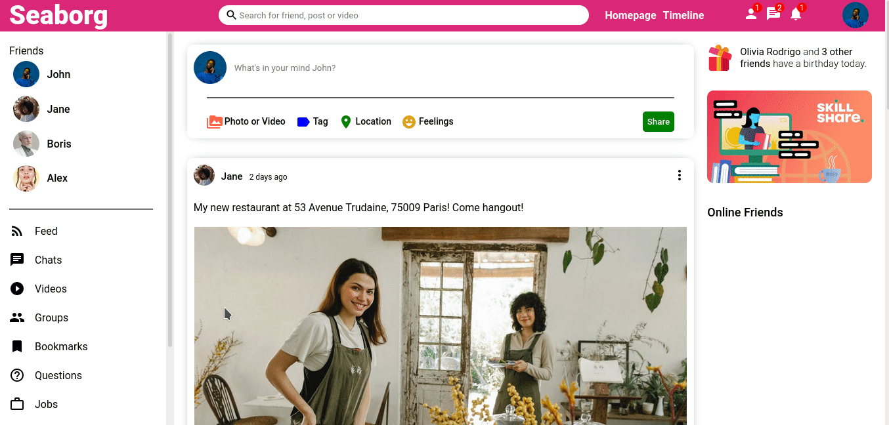
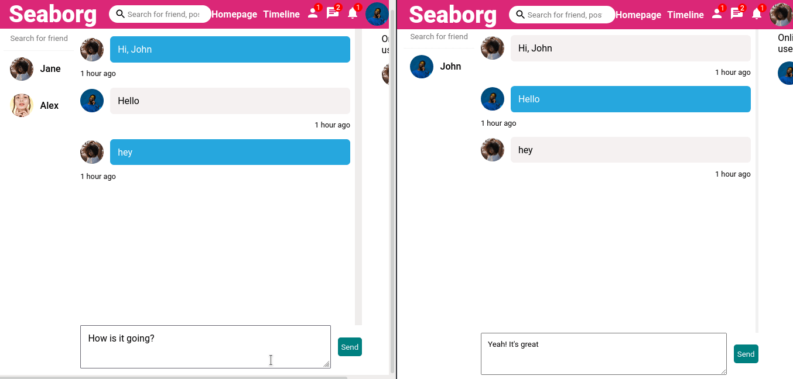

# Seaborg
Seaborg is the full stack social platform for developers, creators & artists to share their awesome work.
This project user MERN stack, and socket.io for instant chat application.

Some of the key features include:
* Get updated by daily posts using Feed
* Includes Feed, Profile, Messenger pages
* User Authentication using email/password
* Instant Chat Application using Socket.io
* Follow/Unfollow user profile

## Live Demo
[Seaborg Social App](https://seaborg.netlify.app/)



## Chat App


## Developing
- Clone this repository
```bash
git clone https://github.com/Nilesh-Das/Seaborg.git
```
- Run react development server
```bash
npm start
```
- Checkout your browser
```
http://localhost:300
```
## TODO
- [ ] Make it Responsive 
- [ ] Add Settings Page
- [ ] Move Assets to CDN
- [ ] Better cloud service for socket server
- [ ] Add more feautures/functionalities

## Contributing

If you want to contribute to this project and make it better, your help is very welcome. Contributing is also a great way to learn more about social coding on Github, new technologies and and their ecosystems and how to make constructive, helpful bug reports, feature requests and the noblest of all contributions: a good, clean pull request.

## License
MIT License 2021 (c) [Nilesh Das](LICENSE)
